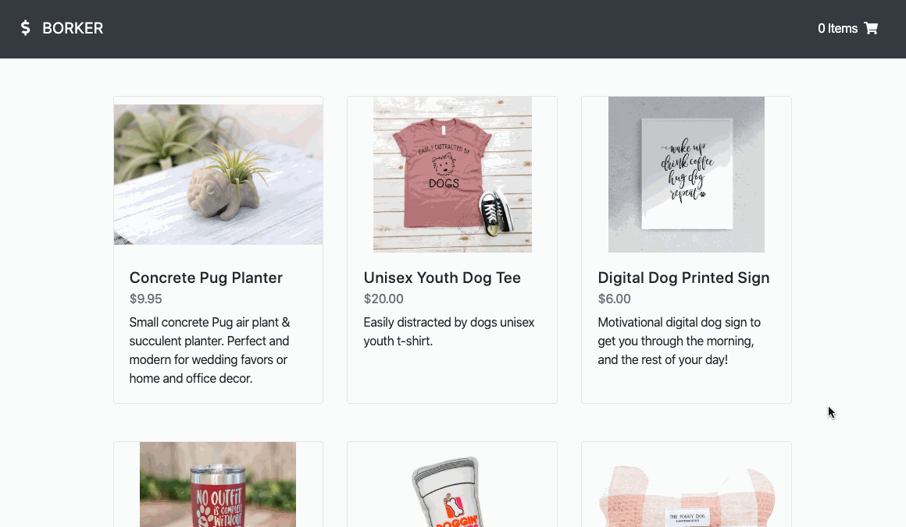

# Borker

Previously known as Wicked Sales. A full stack JavaScript e-commerce application for pet-related products.

## Technologies Used

- React.js
- Webpack 4
- Bootstrap 4
- PHP
- MySQL
- HTML5
- CSS3
- AWS EC2

## Live Demo

Coming Soon

## Features

- User can view a list of products.
- User can view the product details.
- User can add a product to the cart.
- User can view a cart summary.
- User can place an order.

## Preview of the App



## Development

#### System Requirements

- NPM 6 or higher
- MySQL 7 or higher

#### Getting Started

1. Clone the repository.

    ```shell
    git clone https://github.com/juliehchung/borker
    cd borker
    ```

2. Install all dependencies with NPM.

    ```shell
    npm install
    ```

3. Start the project. Once started you can view the application by opening http://localhost:3000 in your browser.

    ```shell
    npm run dev
    ```
